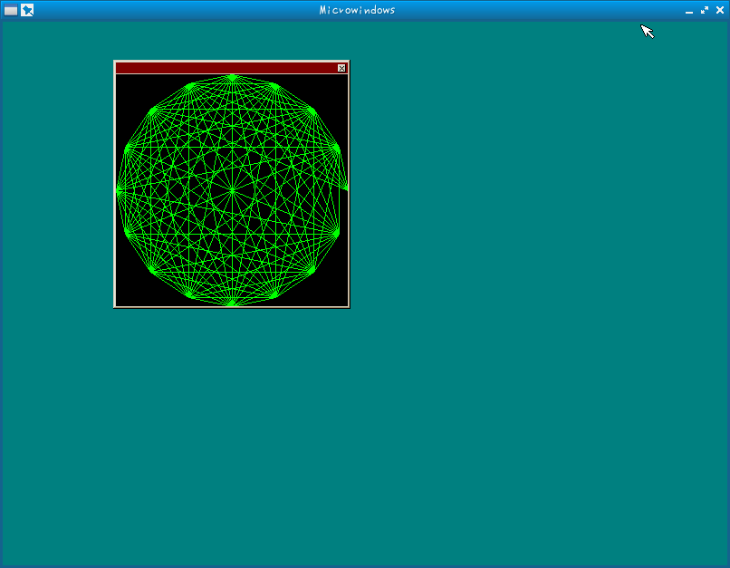
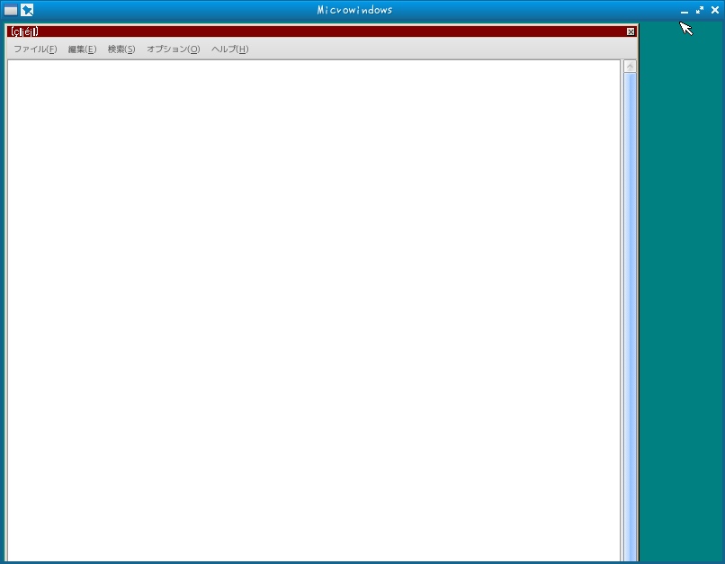

# limeX

Lime-X is the graphic user interface like X.
Original version is https://github.com/ghaerr/microwindows .

## How to make

- Need packages
  - libjpeg-turbo-devel

```bash
$ cp config core/src/config
$ cd core/src
$ make
$ cd ..
$ cd nxlib-*
$ make
$ cd ..
$ cd sample
$ make
```

## How to use

```bash
$ /opt/limex/bin/nano-X &
$ LD_LIBRARY_PATH=/opt/limex/lib /opt/limex/bin/nanowm
$ LD_PRELOAD=/opt/limex/lib/libX11.so ./diamond
$ LD_PRELOAD=/opt/limex/lib/libX11.so leafpad
```

## Screenshots




